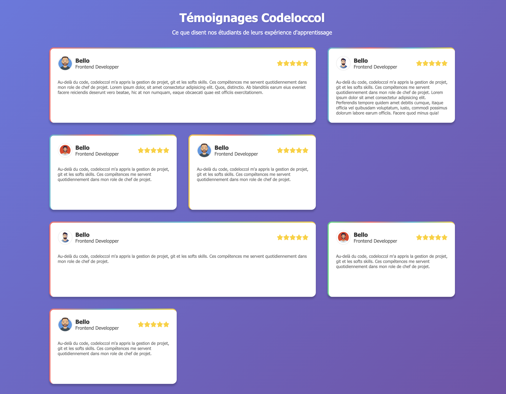
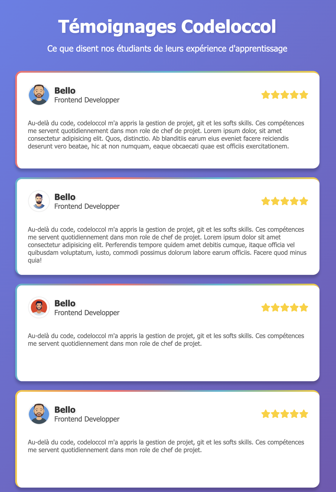

# 🌟 Testimonial Project

Un petit projet front-end présentant une section de témoignages (testimonials) réalisée en **HTML** et **CSS**.  
Ce projet a pour objectif de pratiquer la mise en page, la typographie et le design responsive.

---

## 🧩 Technologies utilisées

- **HTML5** — structure du contenu  
- **CSS3** — mise en page, design et effets visuels  
- *(optionnel :)* **Flexbox / Grid** pour la disposition des éléments

---

## 🚀 Fonctionnalités

- Section de témoignages responsive  
- Design moderne et épuré  
- Utilisation de typographies harmonieuses  
- Adapté aux différents formats d’écran (mobile, tablette, desktop)

---

## 🖼️ Aperçu

Voici un aperçu du rendu final :

---

## Demo
